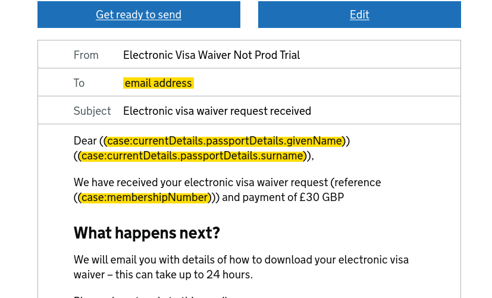
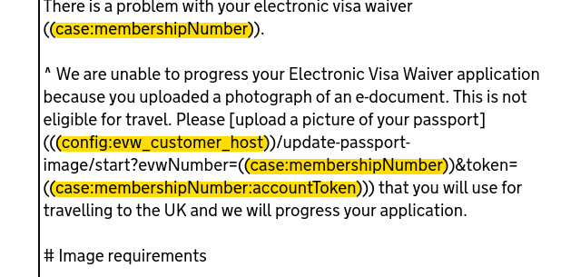
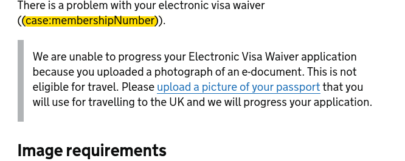
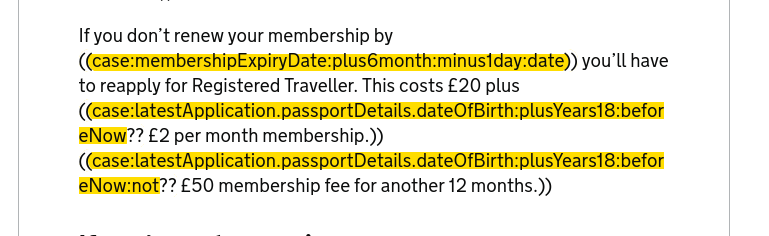

rt-emailer
===========

When making web requests to other microservices such as GovNotify there is a chance the service
is down or a small network blip causes a temporary failure to send an email. For this reason
a reliable solution in your own app requires a stateful queue of outstanding work and some retry logic
to maximise the success rate for sending emails.

Sending emails from your application therefore involves making api calls, handling api authentication,
gracefully handling various network or http errors, building a period retry loop, storing unsent emails
in the database, dealing with timeouts, logging network interactions etc.

The rt-emailer app can do all of these things and comes with a very powerful and generic templating language.
One that had been successfully adopted and understood by non-technical people in the HomeOffice on appropriate
teams. By deploying rt-emailer instead of building a gov notify client directly into your service, you reduce
complexity of the problem to just putting a document into a Mongo collection.

Once rt-emailer is configured and deployed to your solution, and connected to your database you would
send an email by inserting a document into your mongo db collection like this:

GovNotify example:

```json
{
  _id: ObjectId("64628862068f6bb755f5b486"),
  caseId: ObjectId("64627faf068f6bbb2cc906be"),
  date: ISODate("2023-05-15T19:30:42.150Z"),
  recipient: 'my-customer@digital.homeoffice.gov.uk',
  subject: '',
  text: '',
  html: '',
  status: 'WAITING',
  type: 'GovNotifyExampleTemplate',
  cc: [ 'myfriend@example.com' ],
  personalisations: { name: [ 'george'] }
```

rt-emailer can resolve a caseId back to another mongo collection item in order to populate an email. It also has a wide range of functions and data sources that can be mixed together to make a featureful template language. For example it can build urls from configs, or take only parts of a value, or calculate dates, or generate security codes.






rt-emailer was created and released in 2016 and before gaining GovNotify support it sent email via SMTP using the same mongo collection. SMTP delivery was preferable where we sending Arabic content which GovNotify doesn't support. SMTP is slowly being reduced in 2023 as we switch over to GovNotify globally. rt-emailer can send/relay email through Amazon's SES Service. Here is an SMTP example:

```json
{
  _id: ObjectId("64628862068f6bb755f5b486"),
  caseId: ObjectId("64627faf068f6bbb2cc906be"),
  date: ISODate("2023-05-15T19:30:42.150Z"),
  recipient: 'my-customer@digital.homeoffice.gov.uk',
  subject: 'My email subject',
  text: 'hello friend',
  html: '<html><b>hello</b></html>',
  status: 'WAITING',
  type: 'MyEmailType',
  cc: [ 'myfriend@example.com' ],
  personalisations: { name: [ 'george'] }
```

## Functions

[Here are the functions](src/main/scala/uk/gov/homeoffice/rtemailer/model/TemplateFunctions.scala) this app supports.

